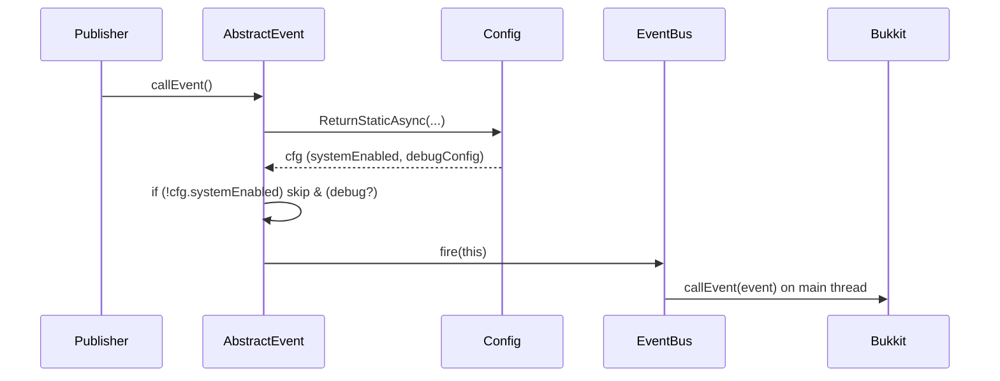

# Event System

> **Scope:** This document explains the event architecture provided by the core: the abstract base event, dispatch guarantees, debug signals, and how plugin modules should publish and consume events.

---

## Goals & Design Principles

* **Consistency:** All plugin events share a single abstract base that encapsulates Bukkit boilerplate and thread rules.
* **Safety:** Events are **never** fired from an async thread. Dispatch is marshalled to the main thread.
* **Gating:** If the system is globally disabled (`systemEnabled=false`), events are not fired.
* **Diagnostics:** Optional debug logging around event suppression and dispatch.
* **Simplicity:** Tiny surface area—publishers call `callEvent()`. Consumers register typical Bukkit listeners.

---

## Key Components

### 1) `AbstractScythePluginEvent`

The sealed/base class for all core events. Responsibilities:

* **Bukkit plumbing:** Provides a shared static `HandlerList` and `getHandlers()` implementation.
* **Thread detection:** The constructor passes `!Bukkit.isPrimaryThread()` to the supertype so the event is marked async if created off-thread. Dispatch, however, is still repaired back to main.
* **Dispatch gating:** `callEvent()` checks the global configuration (`ScythePluginConfig.systemEnabled`). If disabled, the event is **skipped**.
* **Main-thread dispatch:** Uses `EventBus` to `callEvent` on the server thread, even when invoked from async code.
* **Debug hooks:** When `debugConfig=true`, logs a line when an event is suppressed or fired.

**Lifecycle**



**Base API**

```java
public abstract class AbstractScythePluginEvent extends Event {
  // Handler list (Bukkit requirement)
  public static HandlerList getHandlerList();
  @Override public HandlerList getHandlers();

  // Main entry point for publishers
  public void callEvent();
}
```

**Publisher contract**

* Construct your concrete event, populate fields, then call `callEvent()`.
* Do **not** call `Bukkit.getPluginManager().callEvent(...)` directly; `callEvent()` already enforces gating and threading.

### 2) `EventBus`

A minimal dispatcher that:

* Fires Bukkit events on the **main thread**.
* Offers `runMain(Runnable)` and `runLater(Runnable, long)` helpers for GUI or follow-up work.

**Selected API**

```java
public final class EventBus {
  public EventBus(Plugin plugin);
  public void fire(Event event);           // main-thread safe
  public void runMain(Runnable task);      // now on main thread
  public void runLater(Runnable task, long delayTicks);
}
```

> `fire(event)` checks `Bukkit.isPrimaryThread()` and either calls immediately or marshals via `Scheduler.main(...)`.

---

## Built-in Core Events

These concrete events extend `AbstractScythePluginEvent` and are already emitted by the core at specific times:

### `ScythePluginConfigReloadEvent`

Fired after configuration has been re-registered (reload). Listeners may safely read the new values.

### `ScythePluginConfigResetEvent`

Fired after configuration has been reset to defaults. Typically follows a full static re-registration.

### `ScythePluginSystemToggleEvent`

Carries the system state transition:

* `oldState` – previous value of `systemEnabled`.
* `newState` – new value of `systemEnabled`.

> Emitted by `ScythePluginConfig.ToggleSystemEnabled(...)` before persistence so listeners can observe the transition moment.

---

## Publishing Events

### Minimal publisher example

```java
public final class RegionRedrawRequestedEvent extends AbstractScythePluginEvent {
  private final UUID regionId;
  public RegionRedrawRequestedEvent(UUID regionId) { this.regionId = regionId; }
  public UUID getRegionId() { return regionId; }
}

// Somewhere in your module
new RegionRedrawRequestedEvent(regionId).callEvent();
```

### Publishing from async code

No change in usage. `callEvent()` will schedule the dispatch on the main thread.

```java
scheduler.async(() -> {
  // heavy I/O work
  new RegionRedrawRequestedEvent(id).callEvent(); // safe: will be marshalled
});
```

### Respecting the global enable flag

`callEvent()` internally reads `ScythePluginConfig.systemEnabled`. If false, the event is not fired (and a debug line is emitted when `debugConfig=true`). Publishers **do not** need to duplicate this check.

---

## Consuming Events

### Registering a listener

```java
public final class MyListener implements Listener {
  @EventHandler
  public void onReload(ScythePluginConfigReloadEvent e) {
    // respond to config reload
  }
}

// During plugin enable
getServer().getPluginManager().registerEvents(new MyListener(), this);
```

### Threading guarantees for listeners

* All events in this system are **delivered on the main thread**.
* You may safely interact with Bukkit API from within the handler.

> If you need async follow-up work, delegate to `Scheduler.async(...)` from inside the handler.

---

## Debugging & Observability

When `ScythePluginConfig.debugConfig` is `true`:

* Suppressed events (when disabled) log: `Skipped event (systemEnabled=false): <EventName>`
* Dispatched events log: `Firing: <EventName>`

Use this to verify that publishers are invoking `callEvent()` as expected.

---

## Best Practices

* **No direct Bukkit dispatch:** Always use `event.callEvent()`.
* **Keep payloads immutable:** Prefer final fields and constructor injection for event data.
* **Name events verb-first:** e.g., `SomethingHappenedEvent`, `UserProfileLoadedEvent`.
* **Avoid heavy work in listeners:** Do I/O asynchronously and return quickly to avoid tick stutter.
* **Document firing points:** Note when and why your module emits custom events.

---

## Common Pitfalls

* **Creating but not calling `callEvent()`:** The event will never reach listeners.
* **Assuming async context:** Handlers run on main. If you need async, explicitly hand off work.
* **Bypassing gating:** Manually calling Bukkit’s `callEvent` will ignore the global enable flag.

---

## How This Integrates With Other Systems

* **Configuration System:** Events are used to signal changes (`Reload`, `Reset`, `SystemToggle`).
* **Scheduler:** Ensures event dispatch and any follow-up tasks are done on the correct thread.
* **Logging:** Uses the lightweight `Log` facade honoring the runtime debug flag.

---

## API Reference (Quick)

### `AbstractScythePluginEvent`

* `void callEvent()` – Main entrypoint; performs enable check and main-thread dispatch.
* `HandlerList getHandlers()` / `static HandlerList getHandlerList()` – Bukkit boilerplate.

### `ScythePluginConfigReloadEvent`

* No extra fields; indicates a reload occurred.

### `ScythePluginConfigResetEvent`

* No extra fields; indicates a reset occurred.

### `ScythePluginSystemToggleEvent`

* `boolean getOldState()` / `boolean getNewState()`

### `EventBus`

* `void fire(Event e)` – Main-thread-safe dispatch to Bukkit.
* `void runMain(Runnable r)` – Execute on main ASAP.
* `void runLater(Runnable r, long delayTicks)` – Execute on main later.

---

## Testing Tips

* Toggle `systemEnabled` and watch for expected suppression/dispatch in logs.
* Register a test listener that increments counters per event to validate wiring.
* Fire events from both main and async contexts to confirm main-thread delivery.

---

## Migration Notes

If you previously dispatched events directly via Bukkit:

* Replace `Bukkit.getPluginManager().callEvent(e)` with `e.callEvent()`.
* Remove redundant enable checks—`callEvent()` already guards them.
* Keep listener code unchanged.

---

## Examples

### Observing config lifecycle

```java
public final class ReloadAnnouncer implements Listener {
  @EventHandler
  public void onReload(ScythePluginConfigReloadEvent e) {
    getLogger().info("Config reloaded; refreshing caches");
    // invalidate/rebuild caches here
  }
}
```

### Emitting a domain event after an action

```java
public void onRegionSaved(UUID id) {
  new RegionRedrawRequestedEvent(id).callEvent();
}
```

---

## FAQ

**Q: Does `callEvent()` itself fire the Bukkit event?**
**A:** Yes. It routes through `EventBus` to `callEvent` on the main thread. You do not need—and should not—invoke the Bukkit manager yourself.

**Q: What if a listener throws?**
**A:** That’s a standard Bukkit concern; exceptions propagate in the calling tick. Keep handlers small and guarded.

**Q: Can I cancel these events?**
**A:** Use Bukkit’s cancellable pattern for your custom events if you need it. The base class does not impose cancellability.

---

*End of Event System documentation.*
